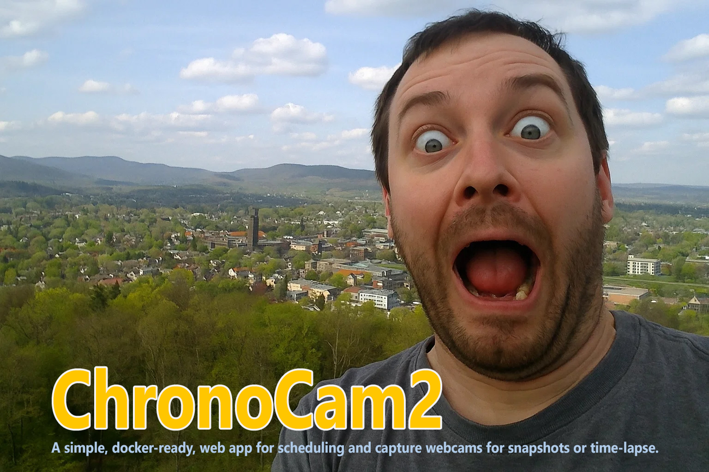

# ChronoCam2


A Docker-ready, simple web app for scheduling and recording webcams for snapshots or time-lapse recordings.

## Table of Contents
- [Overview](#overview)
- [Project Layout](#project-layout)
- [Quickstart](#quickstart)
- [Run (API + Web UI)](#run-api--web-ui)
  - [Endpoints](#endpoints)
- [Configuration](#configuration)
- [Docker Compose](#docker-compose)
  - [Linux Quick Start (Docker Compose)](#linux-quick-start-docker-compose)
- [License](#license)

## Overview
ChronoCam2 is a tool for automatically capturing images from a webcam at regular intervals. Users can define the recording schedule - including specific days, time ranges, or daylight-only operation - making it ideal for outdoor time-lapse documentation, such as construction site monitoring. Its primary purpose is to simplify long-term visual tracking by automating image capture and organization.

## Project Layout
- `app/` — Application code
- `app/config.json` — Runtime configuration

## Quickstart
- Prerequisites: Python 3.10+
- Download project
  ```
  git clone https://github.com/der-pw/chronocam2.git
  cd chronocam2
  ```
- Create a virtual environment
  - Windows PowerShell: `py -3 -m venv .venv && .venv\\Scripts\\Activate.ps1`
  - macOS/Linux: `python3 -m venv .venv && source .venv/bin/activate`
- Install dependencies: `python -m pip install -r requirements.txt`

## Run (API + Web UI)
- Development (auto-reload): `uvicorn app.main:app --reload --port 8000`
- Production (example): `uvicorn app.main:app --host 0.0.0.0 --port 8000`
- Open: http://127.0.0.1:8000/

### Endpoints
- `GET /` — Dashboard (templates + static)
- `GET /events` — Server-Sent Events for live updates
- `GET /settings` — Settings page
- `GET /status` — JSON status for UI
- `POST /update` — Save settings (form submit)
- `POST /action/{pause|resume|snapshot}` — Control actions

## Configuration
- File: `app/config.json`
- Keys (subset):
  - `cam_url`: string; webcam snapshot URL
  - `username` / `password`: optional, for `basic`/`digest` auth
  - `auth_type`: `none` | `basic` | `digest`
  - `save_path`: directory to store snapshots (default `./data`)
  - `interval_seconds`: polling interval for snapshots
  - `active_start` / `active_end`: HH:MM window for activity
  - `active_days`: list like `["Mon", "Tue", ...]`
  - `use_astral`: bool; restrict by sunrise/sunset
  - `city_lat` / `city_lon` / `city_tz`: location settings
  - `language`: `de` or `en` (templates/i18n)


## Docker Compose

Use Docker Compose to run ChronoCam2 with persistent storage.

Basic File `docker-compose.yml`:

```yaml
services:
  chronocam2:
    container_name: chronocam2
    image: derpw/chronocam2:latest

    restart: unless-stopped

    ports:
      - "8001:8000"

    volumes:
      - ./data:/data
    environment:
      TZ: "Europe/Berlin"

    user: "1000:1000"
```

Notes:
- `8001:8000` maps the container's web UI to host port 8001.
- `./data:/data` persists captured images/config outside the container.
- Adjust `TZ` to your timezone and `user` to the correct UID:GID.

### Linux Quick Start (Docker Compose)

- Create project folder and enter it:
  - `mkdir -p chronocam2 && cd chronocam2`
- Create `docker-compose.yml` in this folder with the content above.
- Create data folder and set ownership (adjust UID:GID as needed):
  - `mkdir -p data`
  - `sudo chown 1000:1000 data`
- Pull images: `docker compose pull`
- Start in background: `docker compose up -d`
- Open the UI: `http://<your-dockerhost>:8001`


## License
This project uses the MIT License. See `LICENSE` for details. If you prefer a different license (Apache-2.0, GPL-3.0, etc.), replace the file accordingly.
